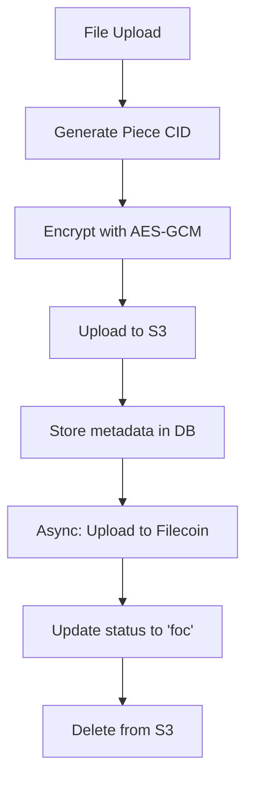
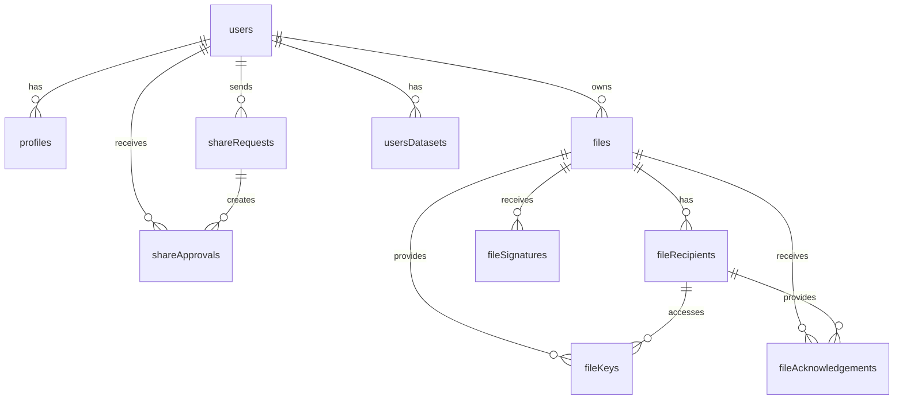

# Filosign Storage Architecture

**Multi-layer storage**: Blockchain immutability + relational DB + decentralized files + client caching. Ensures security, performance, and decentralization.

## Storage Layers

### **1. On-Chain Storage (Filecoin Virtual Machine)**

#### **Smart Contract State**
**Permanent, immutable blockchain records for critical data**

| Contract | Purpose | Data Stored | Access Pattern |
|----------|---------|--------------|----------------|
| **FSManager** | Protocol management | Access permissions, protocol version | Read-heavy |
| **FSKeyRegistry** | User identity | PIN commitments, cryptographic key commitments | Write-once, read-many |
| **FSFileRegistry** | Document registry | Document identifiers, recipient lists (planned) | Event-based |

#### **Data Structure**
```solidity
// User cryptographic commitments
struct KeygenData {
    bytes16 salt_pin;           // PIN salt commitment
    bytes16 salt_seed;          // Master seed salt
    bytes16 salt_challenge;     // Challenge salt
    bytes20 commitment_kyber_pk;    // Kyber public key commitment
    bytes20 commitment_dilithium_pk; // Dilithium public key commitment
}

// Access control mappings
mapping(address => mapping(address => bool)) approvedSenders;
// recipient => sender => approved
```

#### **Storage Characteristics**
- **Immutability**: Data cannot be modified once written
- **Transparency**: All data publicly verifiable
- **Cost**: Expensive storage (~$0.01-0.10 per KB)
- **Latency**: 10-30 seconds for finality
- **Purpose**: Cryptographic proofs, access control, dispute resolution

---

### **2. Off-Chain Database (SQLite + Drizzle ORM)**

#### **Database Architecture**
**Relational data storage with complex relationships and efficient querying**

**Technology Stack:**
- **Engine**: SQLite with WAL mode for concurrent access
- **ORM**: Drizzle ORM with type-safe queries
- **Migrations**: Schema versioning and automated updates
- **Indexing**: Optimized indexes for query performance

#### **Core Tables Schema**

```sql
-- User identity and authentication
CREATE TABLE users (
  walletAddress TEXT PRIMARY KEY,        -- EVM checksum address
  email TEXT,                            -- Optional email
  lastActiveAt INTEGER NOT NULL,         -- Unix timestamp
  keygenDataJson TEXT,                   -- Encrypted crypto material
  encryptionPublicKey TEXT,              -- P-256 public key (hex)
  createdAt INTEGER NOT NULL DEFAULT (unixepoch()),
  updatedAt INTEGER DEFAULT (unixepoch())
);

-- User profiles and social features
CREATE TABLE profiles (
  walletAddress TEXT PRIMARY KEY REFERENCES users(walletAddress) ON DELETE CASCADE,
  username TEXT NOT NULL UNIQUE,
  displayName TEXT NOT NULL,
  avatarUrl TEXT,
  bio TEXT DEFAULT '',
  metadataJson TEXT DEFAULT '{}',
  createdAt INTEGER NOT NULL DEFAULT (unixepoch()),
  updatedAt INTEGER DEFAULT (unixepoch())
);

-- Document metadata and lifecycle
CREATE TABLE files (
  pieceCid TEXT PRIMARY KEY,             -- Filecoin piece CID
  ownerWallet TEXT NOT NULL REFERENCES users(walletAddress),
  metadata TEXT,                         -- JSON metadata
  status TEXT NOT NULL CHECK (status IN ('s3', 'foc', 'unpaid_for', 'invalid')),
  ownerEncryptedKey TEXT NOT NULL,       -- Owner's encrypted AES key
  ownerEncryptedKeyIv TEXT NOT NULL,     -- Initialization vector
  encryptedDataIv TEXT NOT NULL,         -- Document encryption IV
  onchainTxHash TEXT UNIQUE,             -- Blockchain transaction
  createdAt INTEGER NOT NULL DEFAULT (unixepoch()),
  updatedAt INTEGER DEFAULT (unixepoch())
);

-- Document sharing relationships
CREATE TABLE fileRecipients (
  filePieceCid TEXT NOT NULL REFERENCES files(pieceCid) ON DELETE CASCADE,
  recipientWallet TEXT NOT NULL,
  createdAt INTEGER NOT NULL DEFAULT (unixepoch()),
  PRIMARY KEY (filePieceCid, recipientWallet)
);

-- Encrypted keys for secure sharing
CREATE TABLE fileKeys (
  filePieceCid TEXT NOT NULL REFERENCES files(pieceCid) ON DELETE CASCADE,
  recipientWallet TEXT NOT NULL,
  encryptedKey TEXT NOT NULL,            -- Kyber-encrypted AES key
  encryptedKeyIv TEXT NOT NULL,          -- Key encryption IV
  createdAt INTEGER NOT NULL DEFAULT (unixepoch()),
  PRIMARY KEY (filePieceCid, recipientWallet)
);

-- Document acknowledgment proofs
CREATE TABLE fileAcknowledgements (
  filePieceCid TEXT NOT NULL REFERENCES files(pieceCid) ON DELETE CASCADE,
  recipientWallet TEXT NOT NULL,
  acknowledgedTxHash TEXT,               -- On-chain acknowledgment
  createdAt INTEGER NOT NULL DEFAULT (unixepoch()),
  updatedAt INTEGER DEFAULT (unixepoch()),
  PRIMARY KEY (filePieceCid, recipientWallet)
);

-- Digital signatures
CREATE TABLE fileSignatures (
  id TEXT PRIMARY KEY DEFAULT (lower(hex(randomblob(16)))),
  filePieceCid TEXT NOT NULL REFERENCES files(pieceCid) ON DELETE CASCADE,
  signerWallet TEXT NOT NULL,
  signatureVisualHash TEXT NOT NULL,     -- SHA-256 of signature image
  compactSignature TEXT NOT NULL,        -- Dilithium signature
  timestamp INTEGER NOT NULL,
  onchainTxHash TEXT,                    -- Future blockchain anchor
  createdAt INTEGER NOT NULL DEFAULT (unixepoch()),
  updatedAt INTEGER DEFAULT (unixepoch())
);

-- Share capability system
CREATE TABLE shareApprovals (
  id TEXT PRIMARY KEY DEFAULT (lower(hex(randomblob(16)))),
  recipientWallet TEXT NOT NULL REFERENCES users(walletAddress),
  senderWallet TEXT NOT NULL REFERENCES users(walletAddress),
  active INTEGER NOT NULL DEFAULT 0,     -- Boolean as integer
  createdAt INTEGER NOT NULL DEFAULT (unixepoch()),
  updatedAt INTEGER DEFAULT (unixepoch()),
  UNIQUE(recipientWallet, senderWallet)
);

-- Share request lifecycle
CREATE TABLE shareRequests (
  id TEXT PRIMARY KEY DEFAULT (lower(hex(randomblob(16)))),
  senderWallet TEXT NOT NULL REFERENCES users(walletAddress),
  recipientWallet TEXT NOT NULL,
  status TEXT NOT NULL DEFAULT 'PENDING'
    CHECK (status IN ('PENDING', 'ACCEPTED', 'REJECTED', 'CANCELLED', 'EXPIRED')),
  message TEXT,
  metadata TEXT,
  createdAt INTEGER NOT NULL DEFAULT (unixepoch()),
  updatedAt INTEGER DEFAULT (unixepoch())
);

-- User Filecoin datasets
CREATE TABLE usersDatasets (
  walletAddress TEXT REFERENCES users(walletAddress) ON DELETE CASCADE,
  dataSetId INTEGER NOT NULL,
  providerAddress TEXT NOT NULL,
  totalDepositedBaseUnits TEXT NOT NULL DEFAULT '0',
  createdAt INTEGER NOT NULL DEFAULT (unixepoch()),
  updatedAt INTEGER DEFAULT (unixepoch())
);

-- System tables for indexer
CREATE TABLE indexerCheckpoints (
  identifier TEXT PRIMARY KEY,
  blockHeight TEXT NOT NULL,
  updatedAt INTEGER DEFAULT (unixepoch())
);

-- Job queue for background processing
CREATE TABLE jobs (
  id TEXT PRIMARY KEY DEFAULT (lower(hex(randomblob(16)))),
  type TEXT NOT NULL,
  payload TEXT NOT NULL,
  status TEXT NOT NULL DEFAULT 'PENDING'
    CHECK (status IN ('PENDING', 'PROCESSING', 'COMPLETED', 'FAILED')),
  priority INTEGER DEFAULT 0,
  scheduledAt INTEGER,
  startedAt INTEGER,
  completedAt INTEGER,
  failedAt INTEGER,
  error TEXT,
  retryCount INTEGER DEFAULT 0,
  createdAt INTEGER NOT NULL DEFAULT (unixepoch()),
  updatedAt INTEGER DEFAULT (unixepoch())
);
```

#### **Database Indexes**
```sql
-- Performance optimization indexes
CREATE INDEX idx_files_owner ON files(ownerWallet);
CREATE UNIQUE INDEX ux_files_pieceCid ON files(pieceCid);
CREATE UNIQUE INDEX ux_files_onchainTxHash ON files(onchainTxHash);

CREATE UNIQUE INDEX ux_fileRecipients_file_recipient ON fileRecipients(filePieceCid, recipientWallet);
CREATE INDEX idx_fileRecipients_file ON fileRecipients(filePieceCid);

CREATE UNIQUE INDEX ux_fileKeys_file_recipient ON fileKeys(filePieceCid, recipientWallet);
CREATE INDEX idx_fileKeys_file ON fileKeys(filePieceCid);

CREATE UNIQUE INDEX ux_fileAcknowledgements_file_recipient ON fileAcknowledgements(filePieceCid, recipientWallet);
CREATE INDEX idx_fileAcknowledgements_file ON fileAcknowledgements(filePieceCid);

CREATE INDEX idx_signatures_file ON fileSignatures(filePieceCid);

CREATE UNIQUE INDEX ux_shareApprovals_recipient_sender ON shareApprovals(recipientWallet, senderWallet);
CREATE INDEX idx_shareApprovals_recipient ON shareApprovals(recipientWallet);
CREATE INDEX idx_shareApprovals_sender ON shareApprovals(senderWallet);
```

---

### **3. File Storage Layer**

#### **Multi-Tier File Storage**
**Hybrid approach combining speed, cost, and decentralization**

| Storage Tier | Technology | Purpose | Retention | Access Speed |
|--------------|------------|---------|-----------|--------------|
| **Hot Storage** | AWS S3 | Fast uploads/downloads | 30 days | <100ms |
| **Warm Storage** | Filecoin | Decentralized archive | Permanent | 1-5 seconds |
| **Cold Storage** | Filecoin Deals | Long-term preservation | 5+ years | Minutes |

#### **File Storage Flow**



#### **Storage Economics**
- **S3 Cost**: ~$0.023/GB/month (temporary storage)
- **Filecoin Cost**: ~$0.001-0.005/GB/month (permanent storage)
- **Migration**: Automatic after upload completion
- **Retrieval**: Direct from Filecoin for permanent access

---

### **4. Client-Side Storage**

#### **Multi-Layer Client Storage**
**Progressive caching for optimal performance**

| Storage Type | Technology | Purpose | Persistence | Capacity |
|--------------|------------|---------|-------------|----------|
| **IndexedDB** | Browser DB | API response caching | Permanent | Unlimited |
| **LocalStorage** | Browser API | Configuration data | Permanent | ~5-10MB |
| **SessionStorage** | Browser API | Session data | Tab lifetime | ~5-10MB |
| **Memory** | Runtime | Active session keys | Process lifetime | RAM limited |

#### **IndexedDB Schema**
```javascript
// API response cache database
const cacheDB = {
  name: "filosign-cache",
  version: 2,
  stores: {
    cache: {
      keyPath: "id",
      indexes: {
        byTimestamp: "timestamp"
      }
    }
  }
};

// Cache entry structure
interface CacheEntry {
  id: string;              // Cache key
  data: string;           // JSON stringified data
  timestamp: number;      // Unix timestamp
  expiresAt?: number;     // Optional expiration
}
```

#### **Storage Hierarchy**
```
Memory (Active Keys)
├── SessionStorage (Session Data)
├── LocalStorage (Configuration)
└── IndexedDB (API Cache)
    ├── User profiles
    ├── File lists
    ├── Share requests
    └── Cached metadata
```

---

## Data Relationships & Integrity

### **Entity Relationship Diagram**



### **Referential Integrity**
- **Cascade Deletes**: Removing a user deletes all related data
- **Foreign Key Constraints**: Prevent orphaned records
- **Unique Constraints**: Prevent duplicate relationships
- **Check Constraints**: Enforce data validity (statuses, addresses)

---

## Query Performance & Optimization

### **Common Query Patterns**

#### **Sent Files with Recipients and Signatures**
```sql
SELECT
  f.pieceCid, f.ownerWallet, f.metadata, f.status, f.createdAt,
  fr.recipientWallet, fr.acknowledged, fr.acknowledgedTxHash,
  p.username, p.displayName, p.avatarUrl,
  fs.id, fs.signerWallet, fs.signatureVisualHash, fs.timestamp
FROM files f
LEFT JOIN fileRecipients fr ON f.pieceCid = fr.filePieceCid
LEFT JOIN profiles p ON fr.recipientWallet = p.walletAddress
LEFT JOIN fileAcknowledgements fa ON fr.filePieceCid = fa.filePieceCid
  AND fr.recipientWallet = fa.recipientWallet
LEFT JOIN fileSignatures fs ON f.pieceCid = fs.filePieceCid
WHERE f.ownerWallet = ?
ORDER BY f.createdAt DESC, fs.timestamp DESC
LIMIT ? OFFSET ?;
```

#### **Permission-Based File Access**
```sql
-- Check if user can access file
SELECT
  CASE
    WHEN f.ownerWallet = ? THEN 'owner'
    WHEN fr.recipientWallet IS NOT NULL THEN 'recipient'
    ELSE NULL
  END as role,
  fa.acknowledgedTxHash IS NOT NULL as acknowledged
FROM files f
LEFT JOIN fileRecipients fr ON f.pieceCid = fr.filePieceCid
  AND fr.recipientWallet = ?
LEFT JOIN fileAcknowledgements fa ON fr.filePieceCid = fa.filePieceCid
  AND fa.recipientWallet = ?
WHERE f.pieceCid = ?;
```

#### **Share Network Discovery**
```sql
-- Find users I can send to (approved by them)
SELECT sa.recipientWallet, p.username, p.displayName, p.avatarUrl
FROM shareApprovals sa
LEFT JOIN profiles p ON sa.recipientWallet = p.walletAddress
WHERE sa.senderWallet = ? AND sa.active = 1;

-- Find users who can send to me (I've approved)
SELECT sa.senderWallet, p.username, p.displayName, p.avatarUrl
FROM shareApprovals sa
LEFT JOIN profiles p ON sa.senderWallet = p.walletAddress
WHERE sa.recipientWallet = ? AND sa.active = 1;
```

### **Indexing Strategy**
- **Primary Keys**: All tables have efficient primary keys
- **Foreign Key Indexes**: Automatic indexing on foreign key columns
- **Composite Indexes**: Multi-column indexes for common query patterns
- **Unique Indexes**: Prevent duplicate data and optimize lookups
- **Partial Indexes**: Status-based filtering optimization

---

## Data Synchronization & Consistency

### **Blockchain Synchronization**
**Indexer system for on-chain data synchronization**

```typescript
// Indexer checkpoint system
interface IndexerCheckpoint {
  identifier: string;    // Contract event type
  blockHeight: bigint;  // Last processed block
}

// Event processing flow
async function processEvents(fromBlock: bigint, toBlock: bigint) {
  // 1. Fetch logs from blockchain
  const logs = await publicClient.getLogs({
    address: contractAddress,
    events: contractEvents,
    fromBlock,
    toBlock
  });

  // 2. Process each event
  for (const log of logs) {
    await processEvent(log);
    await updateCheckpoint(identifier, log.blockNumber);
  }
}

// 3. Update database state
async function processEvent(log: Log) {
  switch (log.eventName) {
    case 'SenderApproved':
      await updateShareApproval(log.args);
      break;
    case 'KeygenDataRegistered':
      await updateUserKeygenData(log.args);
      break;
  }
}
```

### **Cross-Reference Validation**
- **On-chain vs Off-chain**: Verify database state against blockchain
- **File existence**: Validate S3/Filecoin file presence
- **Key consistency**: Ensure encrypted keys match recipients
- **Signature validity**: Verify Dilithium signatures against stored data

---

## Backup & Recovery

### **Backup Strategy**
- **Database**: Daily automated backups with WAL mode
- **File Storage**: Multi-region replication in S3
- **Blockchain**: Immutable records (no backup needed)
- **Client Data**: User responsibility (encrypted keys stored locally)

### **Disaster Recovery**
- **Database**: Point-in-time recovery from backups
- **Files**: Cross-region failover for S3, Filecoin redundancy
- **Keys**: Master seed regeneration from PIN + wallet signature
- **RTO/RPO**: <4 hours recovery time, <1 hour data loss

---

## Performance Characteristics

### **Database Performance**
| Operation | Query Type | Avg Time | Optimization |
|-----------|------------|----------|--------------|
| File listing | SELECT with JOINs | ~50ms | Multi-column indexes |
| Permission check | Simple SELECT | ~10ms | Unique indexes |
| File upload | INSERT + multiple | ~100ms | Batch operations |
| Search users | LIKE query | ~25ms | Full-text search |

### **Storage Performance**
| Storage Type | Write Speed | Read Speed | Cost/GB/Month |
|--------------|-------------|------------|---------------|
| SQLite | ~10MB/s | ~50MB/s | $0 |
| S3 | ~50MB/s | ~100MB/s | $0.023 |
| Filecoin | ~1MB/s | ~5MB/s | $0.001 |
| IndexedDB | ~5MB/s | ~20MB/s | $0 |

### **Caching Performance**
- **API Responses**: 90%+ hit rate for user data
- **File Metadata**: Cached for 1 hour
- **User Profiles**: Cached for 24 hours
- **Share Permissions**: Cached for 5 minutes

---

## Security Considerations

### **Data Encryption at Rest**
- **Database**: Transparent encryption for sensitive fields
- **Files**: AES-GCM encryption with unique keys per file
- **Keys**: Kyber-encrypted key material
- **Client Storage**: Encrypted seed material

### **Access Control**
- **Row-Level Security**: Users can only access their own data
- **API Authentication**: JWT-based session validation
- **File Permissions**: Owner + recipient access control
- **Blockchain Verification**: On-chain permission validation

### **Data Privacy**
- **Zero-Knowledge**: Server never sees plaintext keys
- **End-to-End Encryption**: Files encrypted for intended recipients only
- **Anonymity**: No personally identifiable information required
- **Right to Deletion**: Complete user data removal on request

This storage architecture provides **enterprise-grade reliability** while maintaining the decentralization and cryptographic security that makes Filosign unique in the e-signature space.
