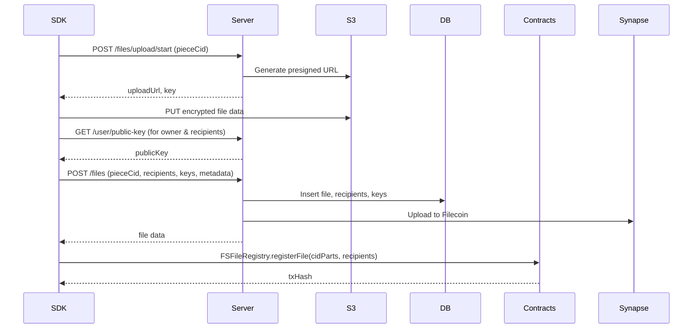
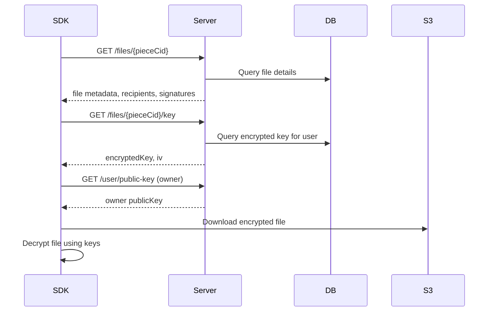
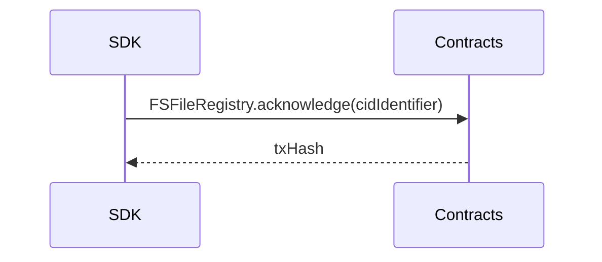
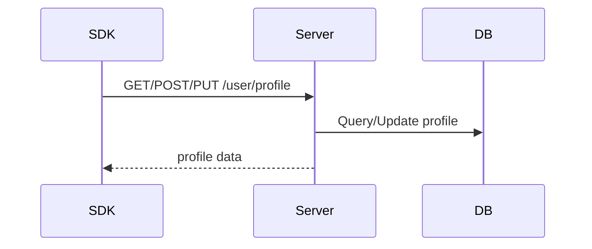
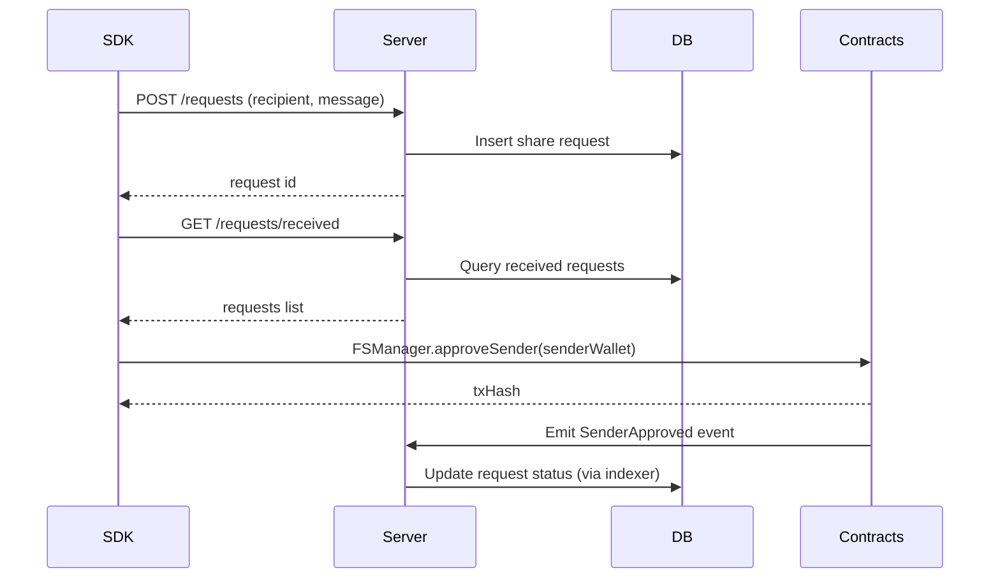
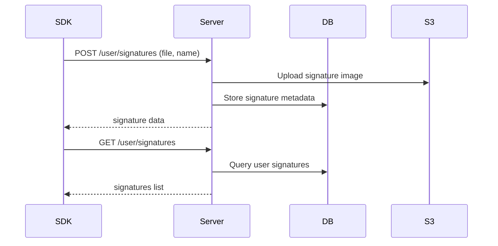
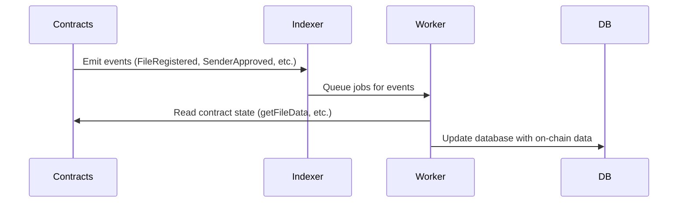

# Filosign Core Flow Documentation

This document details the actual calls and interactions between the **SDK**, **Server**, and **Contracts** in the Filosign core system, based on the codebase.

## Architecture Overview

- **SDK (lib/)**: Client-side library that handles API calls to Server and direct contract interactions.
- **Server (server/)**: Backend API server that manages database, authentication, and indexes blockchain events.
- **Contracts (contracts/)**: Smart contracts on blockchain for on-chain logic and data.

## Primary Flow: SDK → Server → SDK → Contracts

Most operations follow: SDK calls Server API for data/storage, then SDK calls Contracts for on-chain actions.

## Detailed API Flows

### File Upload Flow

**SDK Methods**: `Files.uploadFile()`
**Server Routes**: `/files/upload/start`, `/files`, `/user/public-key`
**Contract Calls**: `FSFileRegistry.registerFile()`

### File Viewing Flow

**SDK Methods**: `Files.getFileDetails()`, `Files.viewFile()`
**Server Routes**: `/files/{pieceCid}`, `/files/{pieceCid}/key`, `/user/public-key`

### File Acknowledgment Flow

**SDK Methods**: `Files.acknowledgeFile()`
**Contract Calls**: `FSFileRegistry.acknowledge()`

### Profile Management Flow

**SDK Methods**: `Profile.getProfile()`, `createProfile()`, `updateProfile()`
**Server Routes**: `/user/profile`

### Share Request Flow

**SDK Methods**: `ShareCapability.sendShareRequest()`, `getReceivedRequests()`, `allowSharing()`
**Server Routes**: `/requests`, `/requests/received`
**Contract Calls**: `FSManager.approveSender()`

### Signature Management Flow

**SDK Methods**: `Signatures.uploadSignature()`, `getSignatures()`
**Server Routes**: `/user/signatures`

## Event Indexing Flow (Server Background)

**Server Components**: `lib/indexer/`, `lib/jobrunner/worker.ts`
**Contract Reads**: `FSFileRegistry.getFileData()`, `FSKeyRegistry.keygenData()`, etc.

## Key Contract Functions

### FSFileRegistry.sol
- `registerFile(bytes32,bytes16,bytes32,address[])`: Register file with recipients
- `acknowledge(bytes32)`: Acknowledge receipt of file
- `submitSignature(...)`: Submit digital signature
- `getFileData(bytes32)`: Read file metadata
- `getSignatureData(bytes32)`: Read signature data

### FSKeyRegistry.sol
- `registerKeygenData(KeygenData,bytes32)`: Register user key data
- `isRegistered(address)`: Check if user registered

### FSManager.sol
- `approveSender(address)`: Approve sender for sharing
- `revokeSender(address)`: Revoke sender approval

## Data Flow Summary

- **SDK ↔ Server**: REST API calls for CRUD operations, file uploads, user data
- **SDK → Contracts**: Direct write transactions for on-chain actions
- **Contracts → Server**: Event emissions indexed into database
- **Server → Contracts**: Read operations for indexing and validation

## Notes

- SDK handles encryption/decryption of file data and keys
- Server manages S3 storage and database persistence
- Contracts enforce access control and record immutable data
- All contract writes are initiated by SDK users
- Server indexes events asynchronously to keep DB in sync